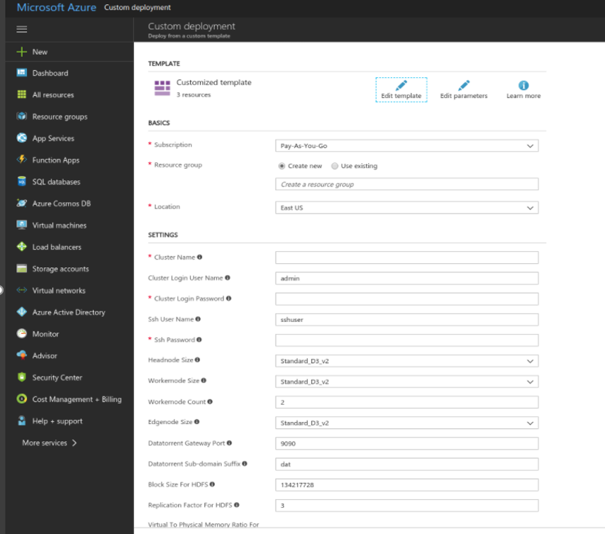

Overview
================================================================================
(TBD - Discuss different installations and heterogeneous environments.)

* [On Premise]
* [Amazon] 
* [Azure]

On Premise
================================================================================
This section covers installation of the DataTorrent RTS platform.

Planning
--------------------------------------------------------------------------------

Installation will extract library files and executables into an installation directory, as
well as start a process called dtGateway, which used to configure the
system, communicate with running applications, and serve the dtManage dashboard UI.  Installation
is typically performed on one of the Hadoop cluster edge nodes, meeting the following criteria:

* Accessible by users who will launch and manage applications
* Accessible by all YARN nodes running Apache Apex applications

*Note*: With [dtGateway security](dtgateway_security.md) configuration disabled, the applications launched
through dtManage interface will appear as started by dtGateway user.


Requirements
--------------------------------------------------------------------------------

* Linux operating system (tested on CentOS 6.x and Ubuntu 12.04)
* Java 7 or 8 (tested with Oracle Java 7, OpenJDK Java 7)
* Hadoop (2.2.0 or above) cluster with YARN, HDFS configured, and hadoop executable available in PATH
* Minimum of 8G RAM available on the Hadoop cluster
* Google Chrome or Safari to access the DataTorrent Console UI
* Permissions to create HDFS directory for DataTorrent user


Installation
--------------------------------------------------------------------------------

Complete installation configures DataTorrent to run as a system service, installs globally available binaries, and requires root/sudo privileges to run.  After the installation is complete, you will have the following

* DataTorrent platform release ( $DATATORRENT_HOME ) located in /opt/datatorrent/releases/[release_version]
* Binaries are available in /opt/datatorrent/current/bin and links in /usr/bin
* Configuration files located in /opt/datatorrent/current/conf
* Log files located in /var/log/datatorrent
* DataTorrent Gateway service dtgateway running as dtadmin, and managed with "sudo service dtgateway" command

Download and run the installer binary on one of the Hadoop cluster nodes.  This can be done on ResourceManager, NameNode, or any node which has correct Hadoop configuration and is able to communicate with the rest of the cluster.

a.  Installing from self-extracting archive (*.bin)

        curl -LSO https://www.datatorrent.com/downloads/datatorrent-rts.bin
        sudo sh ./datatorrent-rts.bin

b.  Installing from RedHat Package Manager archive (\*.rpm)

      curl -LSO https://www.datatorrent.com/downloads/datatorrent-rts.rpm
      sudo rpm -ivh ./datatorrent-rts.rpm


Limited Local Installation
--------------------------------------------------------------------------------

A limited local installation can be helpful for in environments with no root/sudo privileges, or for testing purposes.  All DataTorrent files will be installed under the user's home directory, and DataTorrent Gateway will be running as a local process.  No services or files outside user's home directory will be created.

* DataTorrent platform release ( $DATATORRENT_HOME ) located under $HOME/datatorrent/releases/[release_version]
* Binaries are available under $HOME/datatorrent/current/bin
* Configuration files located under $HOME/datatorrent/conf
* Log files located under $HOME/.dt/logs
* DataTorrent Gateway running as current user, and managed with dtgateway command


1.  Download and run the installer binary on one of the Hadoop cluster nodes.  This can be done on ResourceManager, NameNode, or any node which has correct Hadoop configuration and is able to communicate with the rest of the cluster.

        curl -LSO https://www.datatorrent.com/downloads/datatorrent-rts.bin
        sh ./datatorrent-rts.bin

2.  Add DataTorrent binaries to user PATH environment variable by pasting following into ~/.bashrc, ~/.profile or equivalent environment settings file.

        DATATORRENT_HOME=~/datatorrent/current
        export PATH=$PATH:$DATATORRENT_HOME/bin


Upgrades
--------------------------------------------------------------------------------

DataTorrent RTS installer automatically performs an upgrade when the same base installation directory is selected.  Configurations stored in local files such as dt-site.xml and custom-env.sh, as well as contents of DataTorrent DFS root directory will be be used to configure the newer version.

Automatic upgrade behavior can be avoided by providing installer with an options to perform full uninstall prior to running the installation.  See Customizing Installation section below.  

Full uninstall prior to installation is strongly recommended when performing major version upgrades.  Not all settings and attributes will be backwards compatible between major releases.  This may result in applications failing to launch when an invalid attribute is loaded from dt-site.xml.  In such cases detailed error messages will be provided during an application launch, helping identify and fix outdated references before successfully launching applications.


Customizing Installation
--------------------------------------------------------------------------------

Various options are available to customize the DataTorrent installation.  List of available options be displayed by running installer with -h flag.

    ./datatorrent-rts*.bin -h

    Options:

    -h             Help menu
    -B <path>      Use <path> as base installation directory.  Must be an absolute path.  Default: /opt/datatorrent
    -U <user>      Use <user> user account for installation.  Default: dtadmin
    -G <group>     Use <group> group for installation.  Default: dtadmin ( based on value of <user> )
    -H <path>      Use <path> for location for hadoop executable.  Overrides defaults of HADOOP_PREFIX and PATH.
    -E <expr>      Adds export <expr> to custom-env.sh file.  Used to set an environment variable.  Examples include:
                     -E JAVA_HOME=/my/java                 Java used by dtgateway and Apex CLI
                     -E DT_LOG_DIR=/var/log/datatorrent    Directory for dtgateway logs
                     -E DT_RUN_DIR=/var/run/datatorrent    Directory for dtgateway pid files
    -s <file>      Use <file> DataTorrent dt-site.xml file to configure new installation. Overrides default and previous dt-site.xml
    -e <file>      Use <file> DataTorrent custom-env.sh file to configure new installation. Overrides default and previous custom-env.sh
    -g [ip:]port   DataTorrent Gateway address.  Defaults to 0.0.0.0:9090
    -u             Perform full uninstall prior to running installation. WARNING: All current settings will be removed!
    -x             Skip installation steps.  Useful for debugging installation settings with [-v] or perform uninstall with [-u]
    -r             Uninstall current release only.  Does not remove datatorrent, logs, var, etc directories.  Used with RPM uninstall.
    -v             Run in verbose mode, providing extra details for every step.
    -V             Print DataTorrent version and exit.


Some Hadoop distributions may require changes to default settings.  For example, when running Apache Hadoop, you may encounter that JAVA_HOME is not set for DTGateway user (defaults to dtadmin):

    sudo -u dtadmin hadoop version
    Error: JAVA_HOME is not set and could not be found.

If JAVA_HOME is not set, you can export it manually at the end of /opt/datatorrent/current/conf/custom-env.sh or run the installer with following option to set JAVA_HOME during installation time:

    sudo ./datatorrent-rts*.bin -E JAVA_HOME=/valid/java/home/path

In some Hadoop installations, you may already have an existing user, which has administrative privileges to HFDS and YARN, and you prefer to use that user to run DTGateway service.  Assuming this user is named myuser, you can run the following command during installation to ensure DTGateway service runs as myuser.

    sudo ./datatorrent-rts*.bin -U myuser


Installation Wizard
--------------------------------------------------------------------------------

After the system installation is complete, remaining configuration steps are performed using the Installation Wizard in the DataTorrent UI Console.  DataTorrent UI Console address is typically hostname of the node where DataTorrent platform was installed, listening on port 9090.  The connection details are provided by the system installer, but may need to modified depending on the way Hadoop cluster is being accessed.

    http://<installation_host>:9090/

The Installation Wizard can be accessed and repeated at any time to update key system settings from the Configuration section of the DataTorrent UI Console.

DataTorrent installation can be verified by running included demo applications.  See [Launching Demo Applications](demos.md) for details.

*Note*: The ability to connect to this node and port depends on your environment, and may require special setup such as an ssh tunnel, firewall configuration changes, VPN access, etc.


Disaster Recovery Setup
--------------------------------------------------------------------------------
If you have multiple Hadoop clusters for handling the disasters, then you can install multiple instances of the Gateway on the same machine and service account with each gateway pointing to different cluster.

### Installing Gateway with dtuser(or any other) User

1. Create dtadmin user. This user must have uid > 1000. (adduser -u 1100 dtadmin).
2. Switch to dtadmin user.
3. Copy the hadoop **conf** dir from both the hadoop clusters to the home of dtadmin user. Name them such that you can differentiate between them (For example, $HOME/hadoop_conf1 and $HOME/hadoop_conf2).
4. Download the latest version of the DT RTS installable binary file (datatorrent-rts-<version>.bin).
5. Export JAVA_HOME, HADOOP_HOME and add in PATH. For example:
   * export HADOOP_HOME=/opt/hadoop-2.6.5
   * export JAVA_HOME=/usr
   * export PATH=$HADOOP_HOME/bin:$JAVA_HOME/bin:$PATH
6. Install the first gateway instance using the following command:
```
./datatorrent-rts-<version>.bin -E DT_LOG_DIR=$HOME/datatorrent1 -E DT_RUN_DIR=$HOME/datatorrent1 -E HADOOP_CONF_DIR=$HOME/hadoop_conf1 -B $HOME/datatorrent1 -g 9090
```
7. Install the second gateway instance using the following command:
```
./datatorrent-rts-<version>.bin -E DT_LOG_DIR=$HOME/datatorrent2 -E DT_RUN_DIR=$HOME/datatorrent2 -E HADOOP_CONF_DIR=$HOME/hadoop_conf2 -B $HOME/datatorrent2 -g 9091
```

### Installing Gateway with the Root User:
1. Copy the hadoop **conf** dir from both the hadoop clusters to the home of dtadmin user. Name them such that you can differentiate between them (For example, /opt/hadoop_conf1 and /opt/hadoop_conf2).
2. Download the latest version of the DT RTS installable binary file (datatorrent-rts-<version>.bin).
3. Export JAVA_HOME, HADOOP_HOME and add in PATH. For example:
   * export HADOOP_HOME=/opt/hadoop-2.6.5
   * export JAVA_HOME=/usr
   * export PATH=$HADOOP_HOME/bin:$JAVA_HOME/bin:$PATH
4. Install the first gateway instance using the following command:
```
./datatorrent-rts-<version>.bin -E DT_LOG_DIR=/opt/datatorrent1 -E DT_RUN_DIR=/opt/datatorrent1 -E HADOOP_CONF_DIR=/opt/hadoop_conf1 -B /opt/datatorrent1 -g 9090
```
5. Install the second gateway instance using the following command:
```
./datatorrent-rts-<version>.bin -E DT_LOG_DIR=/opt/datatorrent2 -E DT_RUN_DIR=/opt/datatorrent2 -E HADOOP_CONF_DIR=/opt/hadoop_conf2 -B /opt/datatorrent2 -g 9091
```
**Note :** If you are installing the gateway as a root user, the gateway gets installed globally (or as a service). Hence if you install the second instance after you installing the first,  the command ```service dtgateway stop ``` is used, instead of local script, to stop any previously installed gateways.
Since gateway services are global, the installer cannot distinguish if the previous gateway service is installed at a different location, even if you have provided a new set of directories in the second install, and thus stops the previous service.

Amazon
================================================================================

Azure
================================================================================
# About Azure Deployment

DataTorrent RTS supports seamless deployment in the cloud environment such as Microsoft Azure. It also supports built-in connectors for reading and writing data to popular data sources and stores that are supported by Azure such as Azure event hub and Azure blob storage.

DT RTS also provides ready-made applications to demonstrate capabilities of the platform which can be customized to suit your requirement. This allows quick and easy development of streaming analytics application leveraging capabilities of Azure cloud platform.

## Azure Operators

Datatorrent RTS provides rich library of operators for building streaming applications. It also includes the following operators which are specifically developed for Microsoft azure eco-system. These can be used for reading and writing data to azure data sources or data stores.

### Azure Blob Storage Output Operator

Azure Blob storage is a service for storing large amounts of unstructured object data, such as text or binary data, that can be accessed from anywhere in the world through HTTP or HTTPS. Blob storage can be used to expose data publicly to the world or to store application data privately.

### Azure Event Hub Input Operator

Event Hub input operator receives events from Azure Event Hub in the form of raw byte arrays. It processes them and converts into byte array tuples. These tuples are then processed by downstream operators.

### Azure Event Hub Output Operator

Event Hub Output operator receives events from upstream operator(s) in the form of byte array or string tuples. It converts them into raw byte array format. These tuples are then emitted to Event Hub in Azure cloud.

For more details about including these operators in an application, refer to [Azure Blob Output Storage Operator Guide](operators/azure_blob.md), [Event Hub Input Operator Guide](operators/eventhubinput.md), and [Event Hub Output Operator Guide](operators/eventhuboutput.md).

# Deploying DT RTS on Azure

DataTorrent RTS can be deployed on Azure either from the web interface or from the CLI.

## Prerequisites

For deploying DataTorrent RTS on Azure, you must have the following:

- Active Azure account
- Active Azure subscription
- Azure CLI (For CLI Deployment)

## Deploying DT RTS from Website

From the **DT website** > **Download** page, you can connect to the Azure Resource Manager page wherein you can use a template to create a Linux based HDinsight cluster and install DataTorrent RTS on the edge node.

To deploy DT RTS from Azure Website, do the following:

1. From the DT Website for [downloads](https://www.datatorrent.com/download/), Access the Azure login page.
**Note:** You can proceed only if you have the DT RTS license. In case you do not have the license, you are directed to the **Details** page for obtaining the license for DT RTS.
2. On the Azure login page, enter the Azure user credentials. The **Template** page is displayed.

3. Under **Basics** &gt; **Resource**** group **, either select** Create new **to create a new resource group or select** Use existing** and choose an existing resource group.
4. Select the location.
5. Under **Settings** , enter the following details based on your requirements:

| **Items** | **Description** |
| --- | --- |
| Cluster Name | Enter a name for a cluster. |
| Cluster Login User Name | Enter a user name that can used to submit jobs to the cluster and to log into cluster dashboards. |
| Cluster Login Password | Enter a password. This password must be at least 10 characters in length and must contain at least one digit, one non-alphanumeric character, and one upper or lower-case letter. |
| SsH User Name | Enter the SsH user name which can be used to remotely access the cluster and the edge node virtual machine. |
| SsH Password | Enter the SsH password. This password must be at least 10 characters in length and must contain at least one digit, one non-alphanumeric character, and one upper or lower-case letter. |
| Headnode Size | Specify the VM size of the head nodes. |
| Workernode Size | Specify the VM size of the workernodes. |
| Workernode Count | Specify number of nodes in the cluster. |
| Edgenode Size | Specify the size of the edgenode. |
| Datatorrent Gateway Port | Specify the port where you want to run DataTorrent RTS. |
| Datatorrent sub-domain suffix | Specify the suffix of the DataTorrent sub-domain. This becomes the part of the cluster URL after DT RTS is deployed on Azure. |
| Block size for HDFS | Specify the block size for HDFS. Maintain the default value,  if you are not sure about fine-tuning this value. |
| Replication Factor for HDFS | For example, if the replication factor was set to 3 (default value in HDFS) there would be one original block and two replicas. |
| Virtual to Physical Memory Ratio for YARN | Specify the virtual to physical memory ration for YARN.  Maintain the default value, if you are not sure about fine-tuning this value. |

1. Accept the terms and conditions and click **Purchase**. This spawns the Hadoop cluster with HDInsight.  The deployment process begins which may take about 20-30 minutes to complete. The notification of _Successful Deployment_ is shown on the Azure portal. After the successful deployment, the HDInsight cluster is also displayed under **Resources**.
2. Click the HDInsight cluster name link and then click **Applications**.
The DataTorrent RTS is listed under the installed applications.

### Verifying and completing the deployment

1. In the browser, enter the URL in the following format:
_https://&lt;clustername&gt;-dat.apps.azurehdinsight.net_.
**&lt;clustername&gt;** is the name of the cluster that you had specified while creating the HDInsight cluster.
2. Enter the credentials that was specified for the cluster.
The welcome screen for DT RTS is displayed.
3. Install DataTorrent RTS using the Installation wizard.

## Deploying DT RTS from CLI

DT RTS can be deployed on Azure from the CLI. For this you must download the ZIP file from the DT Website. This ZIP file contains the JSON file template which can be edited to configure the parameters. The path of this JSON file is provided in the Azure CLI commands which deploys DT RTS.

The Azure CLI must be downloaded before the deployment.

To deploy DT RTS from CLI, do the following:

1. Download Azure CLI. Refer [Download](https://docs.microsoft.com/en-us/cli/azure/install-azure-cli?view=azure-cli-latest).
2. Download and extract the ZIP file from DT website.
This ZIP file contains the JSON file template which can be edited to configure the parameters.
3. Edit the JSON file template to configure the following parameters:

| **Items** | **Description** |
| --- | --- |
| clusterName | Enter a name for a cluster. |
| clusterLoginUserName | Enter a user name that can used to submit jobs to the cluster and to log into cluster dashboards. |
| clusterLoginPassword | Enter a password. This password must be at least 10 characters in length and must contain at least one digit, one non-alphanumeric character, and one upper or lower-case letter. |
| sshUserName | Enter the SsH user name which can be used to remotely access the cluster and the edge node virtual machine. |
|  sshPassword | Enter the SsH password. This password must be at least 10 characters in length and must contain at least one digit, one non-alphanumeric character, and one upper or lower-case letter. |
| headnodeSize | Specify the VM size of the head nodes. |
| workernodeSize | Specify the VM size of the workernodes. |
| workernodeCount | Specify number of nodes in the cluster. |
| edgenodeSize | Specify the size of the edgenode. |
| datatorrentGatewayPort | Specify the port where you want to run DataTorrent RTS. |
| datatorrentSub-domainSuffix | Specify the suffix of the DataTorrent sub-domain. This becomes the part of the cluster URL after DT RTS is deployed on Azure. |
| blockSizeForHDFS | Specify the block size for HDFS. Maintain the default value, if you are not sure about fine-tuning this value. |
| replicationFactorForHDFS | For example, if the replication factor was set to 3 (default value in HDFS) there would be one original block and two replicas. |
| virtualToPhysicalMemoryRatioForYARN | Specify the virtual to physical memory ration for YARN.  Maintain the default value, if you are not sure about fine-tuning this value. |

1. From the command prompt, login to Microsoft Azure using the following command:
```
az login
```
The URL and the authentication code is provided.

2. In a web browser, enter this URL and the authentication code and then click **Continue**.

3. On the Microsoft Azure Login page, enter your Microsoft Azure account credentials and login.

4. Go to Azure CLI and enter the following command:

```
az login

az group deployment create \
    --name <Name for the deployment> \
    --resource-group <name for the resource group> \
    --template-uri https://raw.githubusercontent.com/Datatorrent/moodI/master/utils/azure/hdinsight-with-Datatorrent-RTS/azuredeploy.json \
    --parameters @/<path to extracted ZIP file>/azuredeploy.parameters.json
 ```

**Note** : Change the highlighted value within <> to actual values.

A notification is displayed when the deployment is completed. The DataTorrent RTS is deployed on Azure. You can verify and complete the installation using the steps at Verifying and completing the deployment.
