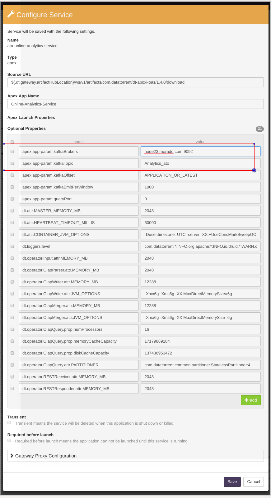
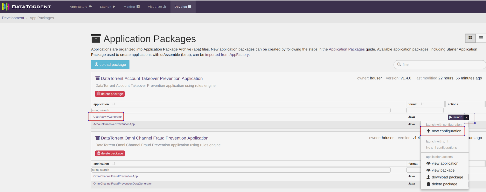
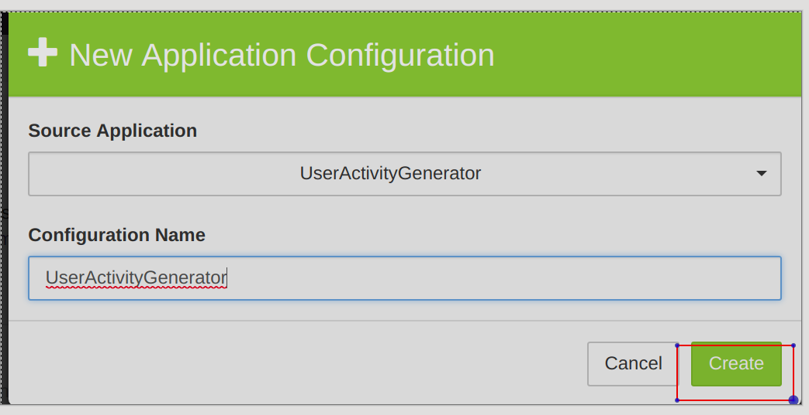

# Launching Account Takeover Prevention Application - Quick Start Guide

## Setup Docker and RTS

1. Setup docker daemon host (preferably same as gateway machine). This supplies the docker images for **Online Analytics Service**, **OAS Dashboards Service** that is a customized implementation of Apache Superset and **CEP Workbench** that is a customized Drools Workbench implementation.
2. Install rts 3.10 bin. In the installation wizard, specify the docker location.


## Launching Account Takeover Prevention Application

1. Import the Account Takeover Prevention Application from the AppFactory.
2. In the DataTorrent Account Takeover Prevention Application box, click **import**. 
3. Download the package, after DataTorrent Account Take Over Prevention Application package is imported.
   - Navigate to **Develop** > **Application Package** > **DataTorrent Account TakeOver Prevention Application**.
   - Click **launch** drop-down and select **download package**.
4. Generate lookup data which will be used by the enrichment operators in the DAG. Use Hadoop user or user that has access to Hadoop.
   
   **Note:** Assuming the Geo Data base file is already copied on the HDFS. If it is not done, follow the steps from the Fraud Prevention Application.

```
Bash
mkdir ato_package
cd ato_package
unzip ../dt-ato-prevention-application-1.4.0.apa 
java -cp app/*:lib/*:`hadoop classpath` com.datatorrent.ato.userActivityGenerator.DumpLookupData ato_lookupdata
```
5. Create configuration for ATO
   - Navigate to **Develop** > **ApplicationPackages** > **+ new configuration** 
   - Click **create**. 
6. Enter the Required Properties. 
2. Configure the **CEP Workbench Service**
   - On the configuration page, scroll down.
   - Select the **drools-workbench** and click **configure**.
   - Click **save** after specifying the configuration.
   **Note:** Ensure that the Proxy Address is set correctly.
7. Configure **Online Analytics Services**.
   - Select the **ato-online-analytics-service** and click **configure**. 
   - Click **save** after the configuration is set correctly.
**Note:** Make sure **KafkaBrokers** and the **KafkaTopic** are set correctly.
8. Configure **OAS Dashboards**.
   - Select **superset-ato** and click **configure**. 
   - Click **save** after the configuration is set correctly.

**Note** : Make sure to set correct druid\_cluster IP and the Proxy Address. 

1. Configure the Dashboards
   - Click **configure**. 
   - From the **Select Replacement Applications** drop down, select the correct configuration name for both the Dashboards.
   - Click **Save**. 
2. Save the complete configuration.

### Account Takeover Prevention Application's User Activity Generator

1. Create new configuration for the **UserActivityGenerator**.
   - Go to **Develop** > **Application Packages** > **+ new configuration**.

2. Add Optional Properties.
   - In **Optional Properties** , click **+add** to add Optional Properties.
**Note:**   **Kafka** topic of the DataGenerator should be same as the **Transaction Receiver** topic of the Omni Channel Fraud Prevention Application.
   - Click **save**.
   - Click **launch** to launch the Data Generator.




## Launching Multi-App Integration Path - 1 (FPA > OAS > OAS Dashboards)

1. Click the **launch** button of the completely configured ATO application configuration. The launch does the following:
   - Imports all the services.
   - Launches the application.
   - Imports the dashboards.
2. Click **launch** button of the completely configured **UserActivityGenerator**. This will send transactions to the Fraud Prevention Application.

## Launching Multi-App Integration Path - 1 (ATO > FPA > OAS > OAS Dashboards)

Property **Facts Output** topic in the ATO and the **Ato Facts Output** topic in the Fraud Application is the bridge between the two applications. Hence, ensure that the same topic is maintained in ATO and Fraud Apps.

1. Click the **launch** button of the completely configured **Fraud Prevention** application, The launch does the following:
   - Imports all the services.
   - Launches the application.
   - Imports the dashboards.
2. Click the **launch** button of the completely configured **OmniChannelFraudPreventionDataGenerator**. This will send transactions to the Fraud Prevention Application.
3. Click the **launch** button of the completely configured **Account Takeover Prevention** application configuration. The launch does the following:
   - Imports all the services.
   - Launches the application.
   - Imports the dashboards.
4. Click the **launch** button of the completely configured **UserActivityGenerator**. This will send transactions to the Account Takeover Prevention Application.

## Configuring Store and Replay for Account Takeover Prevention Application

1. Upload the Fraud Prevention application.
2. Create the configuration with optional properties for archive using Fraud Prevention application.
3. Launch the Fraud Prevention application with the properties required for archive.
4. Create the configuration with optional properties for replay using fraud prevention application.

**Configuration properties for the Account Takeover Prevention Application - Archive**

<configpropertiesarchivefpa>

**Configuration properties for the Account Takeover Prevention Application – Replay**

**Note** : **Transaction Receiver** topic must be the same in archive and replay. Also, the name of the archive application will be used in the replay configuration.

<configpropertiesreplayfpa>

