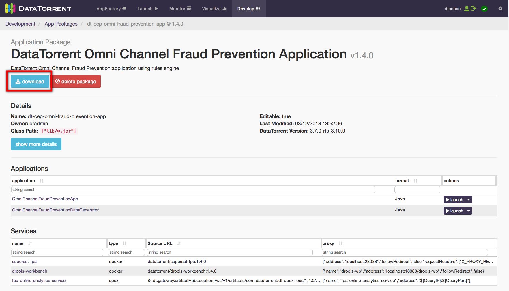
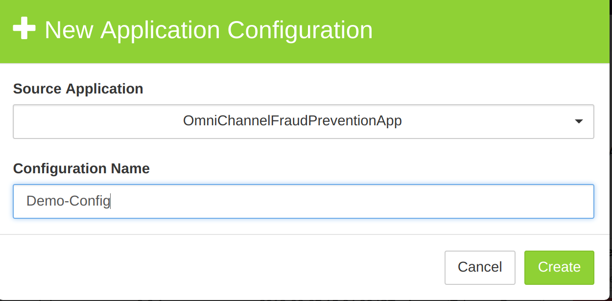
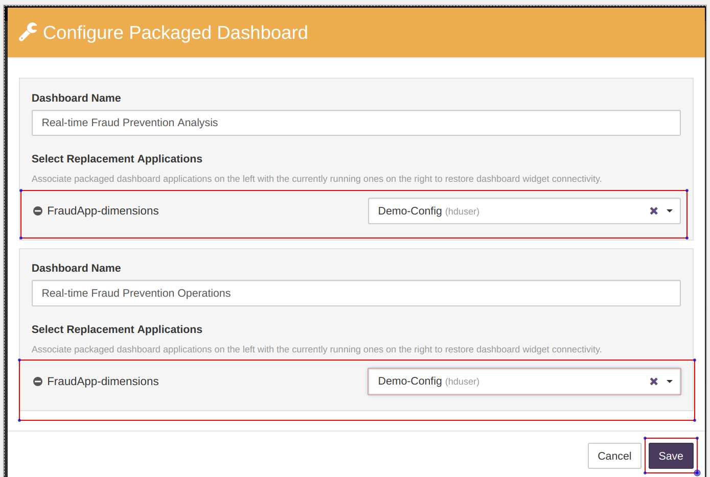
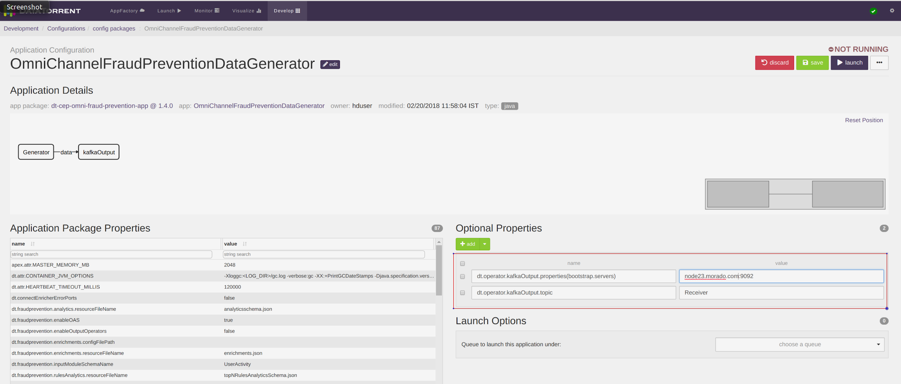
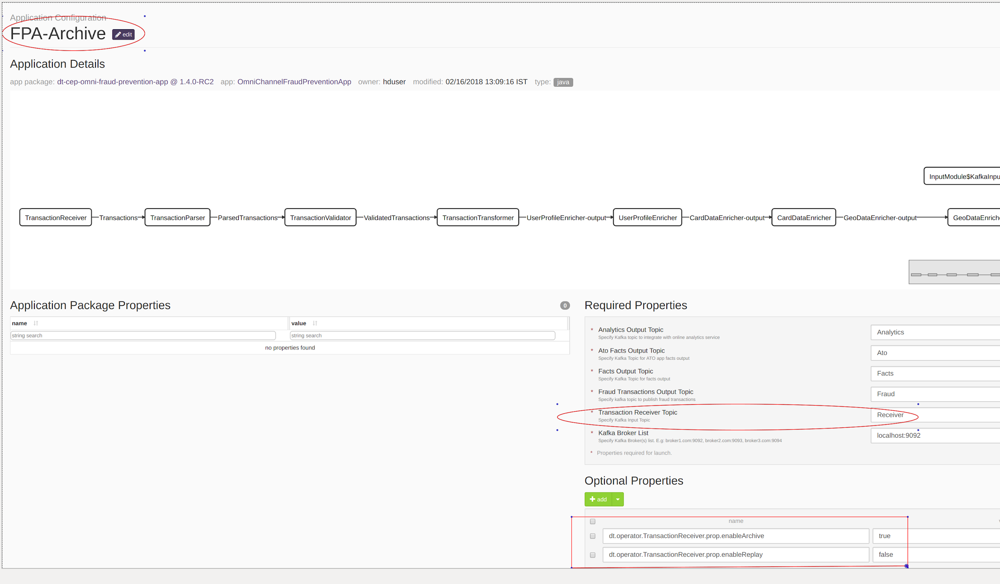
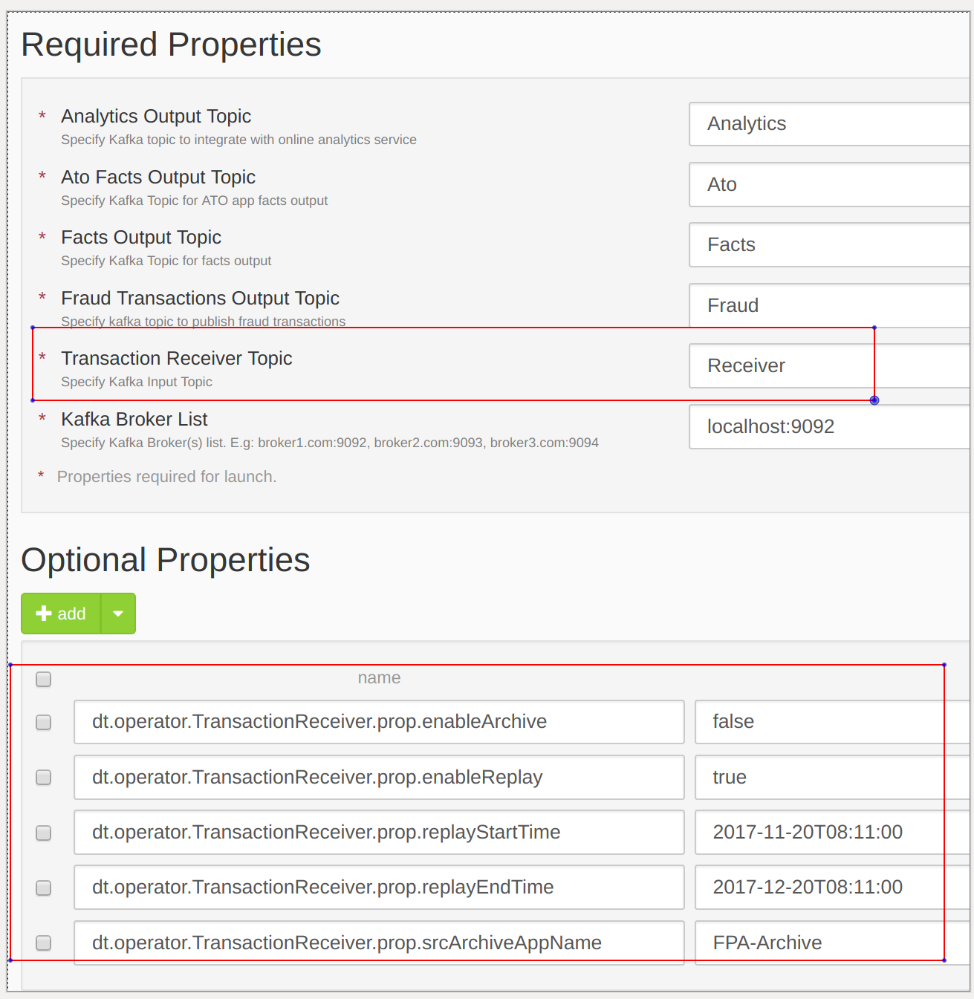

# Quick Start Guide for Launching DataTorrent RTS Applications

# Setup Docker and RTS

1. Setup docker daemon host (preferably same as gateway machine). This supplies the docker images for superset, online analytics service, and drools workbench.
2. Install rts 3.10 bin. In the installation wizard, specify the docker location.

# Launching Fraud Prevention Application

1. Get the Geolite Maxmind Database (Use Hadoop user or user that has access to Hadoop). Using Bash '
`url http://geolite.maxmind.com/download/geoip/database/GeoLite2-City.tar.gz -o GeoLite2-City.tar.gz
tar -zxvf GeoLite2-City.tar.gz 
hdfs dfs put GeoLite2-City*/GeoLite2-City.mmdb city.mmdb`

2. Navigate to the **AppFactory page** > **Financial Services** > **Omni-Channel Payment Fraud Prevention.**
3. In the DataTorrent Omni Channel Fraud Prevention Application box, click **import**. 
3. Download the application after DataTorrent Omni Channel Fraud Prevention Application package is imported.
4. Navigate to **Develop** > **Application Package** > **Data Torrent Omni Channel Fraud Prevention Application.** Click **launch** drop-down and select **download package**. 
5. Generate lookup data which will be used by enrichment operators in the DAG.  (Use Hadoop user or any user that has access to Hadoop. Using Bash
`mkdir fpa_package
cd fpa_package
unzip ../dt-cep-omni-fraud-prevention-app-1.4.0.apa 
java -cp app/*:lib/*:`hadoop classpath` com.datatorrent.cep.transactionGenerator.DumpLookupData lookupdata`
1. Create a New Configuration for the OmniChannelFraudPreventationApp.
   - Go to **Develop** > **Application Configurations** > **+ create new.**
   - Select a Source Application and enter the Configuration Name and then click **Create**. 
1. Enter the Required Properties. 
2. Configure the Drools-Workbench Service
   - On the configuration page, scroll down.
   - Select the Drools-Workbench and click **configure**.
   - Click **save** after specifying the configuration.
**Note:** Ensure that the Proxy Address is set correctly.
2. Configure the **fpa-online-analytics-service** service.
   - Select the **fpa-online-analytics-service** and click **configure**.
   - Click **save** after specifying the configuration.
**Note** :Ensure that the **KafkaBrokers** and the **KafkaTopic** is set correctly.
1. Configure the **superset-fpa** service.
   - Select the **superset-fpa** and click **configure**
   - Click **save** after specifying the configuration.
  **Note** : Ensure to set correct druid\_cluster IP and the Proxy Address.
1. Configure the Dashboards.
   - Click **configure**.
   - From the **Select Replacement Applications** drop down, select the corresponding configuration name for both the dashboards.
   - Click **Save**.
1. Save the configuration.
   - Click **Save.**
   - Click **launch** to launch the application.

## Fraud Prevention Application's Data Generator

1. Create **New Configuration** for the OmniChannelFraudPreventationDataGenerator.
2. Go to **Develop** > **Application Packages > + new configuration.**
1. Add **Optional Properties**.
   - Under **Optional Properties** , click + **add** and add the required optional properties.
   **Note:**   **Kafka** topic of the DataGenerator should be same as the **Transaction Receiver** topic of the Omni Channel Fraud Prevention Application.
2. Click **save**.
3. Click **launch** to launch the Data Generator. 

# Launching Multi-App Integration Path - 1 (FPA > OAS > SuperSet)

1. Click the **launch** button of the completely configured fraud prevention application configuration. The launch does the following:
   - Imports all the services.
   - Launches the application.
   - Imports the dashboards.
2. Click **launch** button of the completely configured **OmniChannelFraudPreventionDataGenerator**. This will send transactions to the Fraud Prevention Application.

# Launching Multi-App Integration Path - 1 (ATO > FPA > OAS > SuperSet)

Property **Facts Output** topic in the ATO and the **Ato Facts Output** topic in the Fraud Application is the bridge between the two applications. Hence, ensure that the same topic is maintained in ATO and Fraud Apps.

1. Click the **launch** button of the completely configured fraud prevention application configuration. The launch does the following:
   - Imports all the services.
   - Launches the application.
   - Imports the dashboards.
2. Click the **launch** button of the completely configured **OmniChannelFraudPreventionDataGenerator**. This will send transactions to the Fraud Prevention Application.
3. Click the **launch** button of the completely configured **Account Takeover Prevention** application configuration. The launch does the following:
   - Imports all the services.
   - Launches the application.
   - Imports the dashboards.
4. Click the **launch** button of the completely configured **Account TakeOver Prevention DataGenerator**. This will send transactions to the Account Takeover Prevention Application.

# Multi – App Integration Path – 3 Store and Replay with Fraud Application

1. Upload the Fraud Prevention application.
2. Create the configuration with optional properties for archive using Fraud Prevention application.
3. Launch the Fraud Prevention application with the properties required for archive.
4. Create the configuration with optional properties for replay using fraud prevention application.

**Configuration properties for the Fraud Prevention Application - Archive**

**Configuration properties for the Fraud App – Replay**

**Note** : **Transaction Receiver** topic must be the same in archive and replay. Also, the name of the archive application will be used in the replay configuration.
