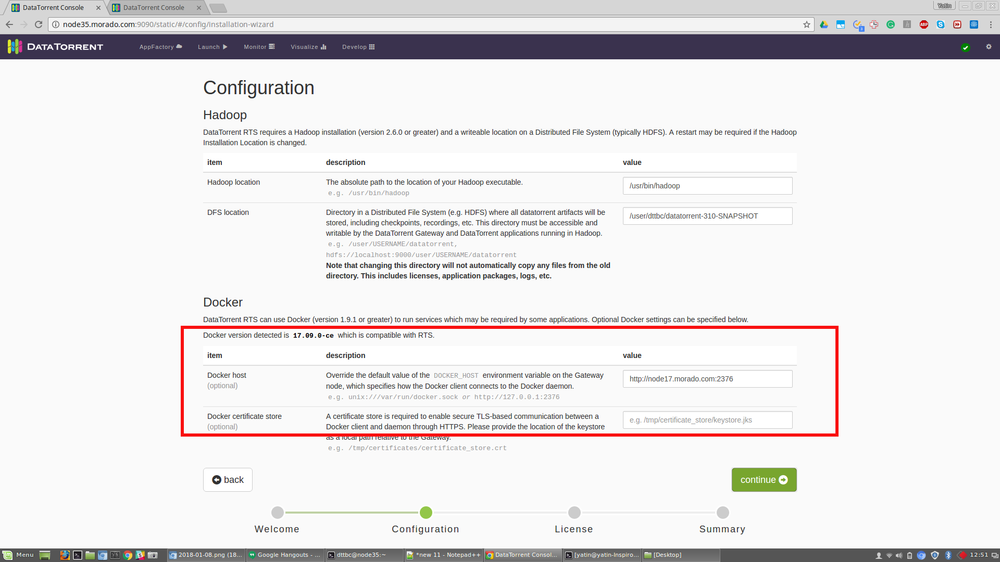
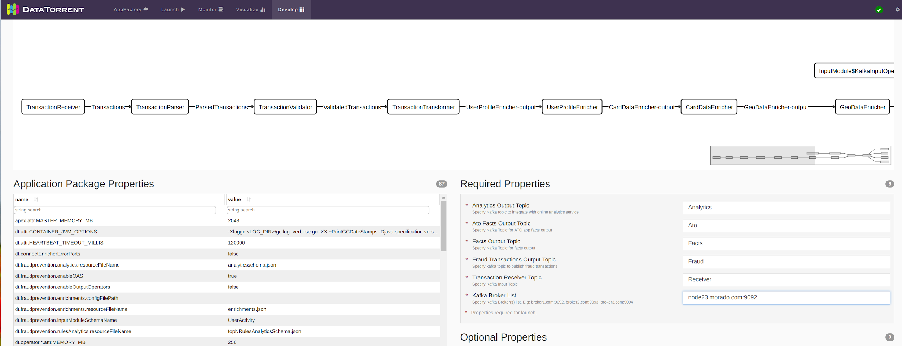
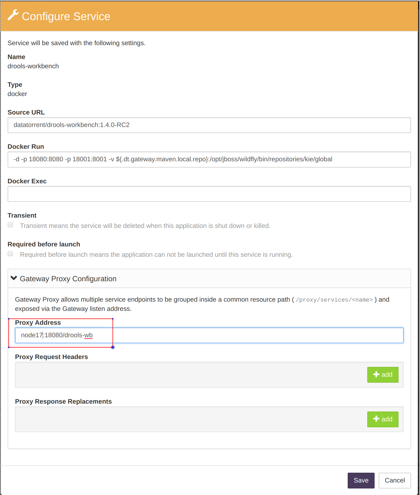
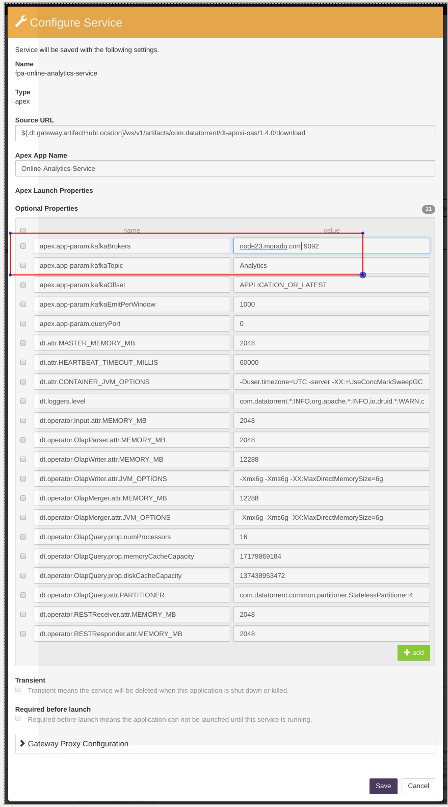
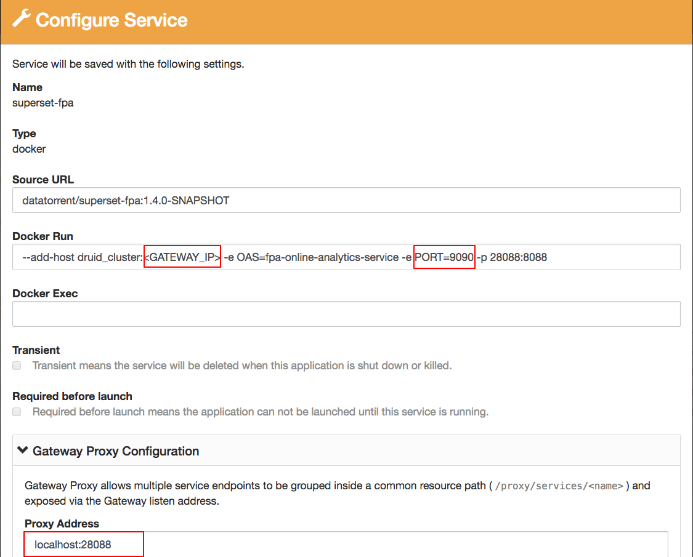

# Quick Start Guide - Omni-Channel Fraud Prevention Application

## Setup Docker and RTS

1. Setup docker daemon host (preferably same as gateway machine). This supplies the docker images for **Online Analytics Service (OAS)**, **OAS Dashboards** which is a customized implementation of Apache Superset, and **CEP Workbench** that is a customized Drools Workbench implementation.
2. Install rts 3.10 bin. In the installation wizard, specify the docker location.

## Launching Fraud Prevention Application

1. Navigate to the **AppFactory page** > **Financial Services** > **Omni-Channel Payment Fraud Prevention.**
2. In the DataTorrent Omni Channel Fraud Prevention Application box, click **import**. 
3. Download the application after DataTorrent Omni Channel Fraud Prevention Application package is imported.
4. Navigate to **Develop** > **Application Package** > **Data Torrent Omni Channel Fraud Prevention Application.** Click **launch** drop-down and select **download package**. 
5. Get the Geolite Maxmind Database (Use Hadoop user or user that has access to Hadoop). Getting Geolite Maxmind Database using Bash:

            url http://geolite.maxmind.com/download/geoip/database/GeoLite2-City.tar.gz -o GeoLite2-City.tar.gz
            tar -zxvf GeoLite2-City.tar.gz 
            hdfs dfs put GeoLite2-City*/GeoLite2-City.mmdb city.mmdb

6. Generate lookup data which will be used by enrichment operators in the DAG. Use Hadoop user or any user that has access to Hadoop. Generating sample lookup data using Bash:

            mkdir fpa_package
            cd fpa_package
            unzip ../dt-cep-omni-fraud-prevention-app-1.4.0.apa 
            java -cp app/*:lib/*:`hadoop classpath` com.datatorrent.cep.transactionGenerator.DumpLookupData lookupdata

7. Create a New Configuration for the OmniChannelFrudPreventationApp.

    1. Go to **Develop** > **Application Configurations** > **+ create new.**
    2. Select a Source Application and enter the Configuration Name and then click **Create**.            
8. Enter the Required Properties. 
9. Configure the **CEP Workbench Service**.    

    1. On the configuration page, scroll down.
    2. Select the **drools-workbench** and click **configure**.
    3. Click **save** after specifying the configuration. **Note:** Ensure that the Proxy Address is set correctly.
            
10. Configure the **Online Analytics Service**.
           
    1. Select the **fpa-online-analytics-service** and click **configure**.
    2. Click **save** after specifying the configuration. **Note** :Ensure that the **KafkaBrokers** and the **KafkaTopic** is set correctly.
            
11. Configure the **OAS Dashboards** service.
            
    1. Select **superset-fpa** and click **configure**
    2. Click **save** after specifying the configuration. **Note** : Ensure to set correct druid\_cluster IP and the Proxy Address.
            
12. Configure the Dashboards.
    
    1. Click **configure**.
    2. From the **Select Replacement Applications** drop down, select the corresponding configuration name for both the dashboards.
    3. Click **Save**.
            
13. Save the configuration.

    1. Click **Save.**
    2.Click **launch** to launch the application.
      
## Launch Test Data Generator Application

1. Create **New Configuration** for the OmniChannelFraudPreventationDataGenerator.
2. Go to **Develop** > **Application Packages > + new configuration.**
3. Add **Optional Properties**. Under **Optional Properties**, click **+ add** and add the required optional properties. **Note:** **Kafka** topic of the DataGenerator should be same as the **Transaction Receiver** topic of the Omni Channel Fraud Prevention Application.
4. Click **save**.
5. Click **launch** to launch the Data Generator. 
