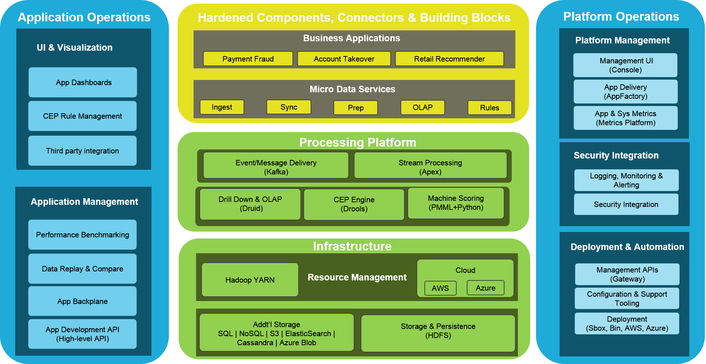

DataTorrent RTS Overview
================================================================================
DataTorrent helps large enterprises to build, deploy, and operate fast data analytic applications. Companies need to gain insight and take action on events that impact their business at the speed of their business.  DataTorrent's Real-time Streaming (RTS) platform makes it easy to deliver fast data analytics applications that drive business outcomes using the latest innovation in data science and machine learning. It integrates best-of-breed open source technology innovation to provide all the features that a business needs to develop and deliver best-in-class, fast data applications.

RTS is a production-grade platform that is designed to ingest, transform, and analyze every type of data, as soon as it is generated, in real-time. RTS is set in an unique framework namely APOXI which binds applications and microservices allowing them to scale and act as one. It is powered by the open-source Apache Apex engine along with an easy-to-use management and monitoring UI, real-time dashboards, automated fault-tolerance, and real-time predictive models.

This image provides an overview of the RTS architecture:

The following features are included in DataTorrent RTS:
- Hardened real-time fast data processing engine
- Pre-built Applications, building blocks, and tooling for developer productivity
- Management, security, and enterprise integration for production operability
- Production support, training, and expert services

RTS can be deployed either on-premise or in the cloud. Further it is also backed with enterprise-class support and expertise to make adoption and execution smooth.

DataTorrent offers three types of [license subscriptions](Licensing.md) for RTS:
- **Free**
- **DataTorrent Service Plus®**
- **DataTorrent Premium Suite®**  

The following table describes the major elements of RTS:

| Item | Description|
| :------------- | :------------- |
| **Fast Big Data Stack** | RTS leverages open source creativity and innovation by integrating and hardening the best-of-breed technologies that enable customers to quickly develop enterprise quality applications. For more information, refer [About Fast Big Data Stack](fast_big_data_stack.md)      |**Apoxi**| APOXI is the RTS framework that helps develop and operate big data products by stitching together data services. APOXI includes all the glue logic, registries, metrics platform, and application backplane required to get to production quickly. For more information, refer [About Apoxi](apoxi.md)|
| **Heterogeneous Environments** | All the artifacts that are available in DataTorrent are hardened and certified for both Amazon and Azure. Your application will work seamlessly on-premises as well as on cloud with minimal or no changes. RTS includes connectors to all major Amazon and Azure technologies. For more information, refer [About Heterogeneous Environments](heterogeneous_env.md)|
| **AppFactory** | RTS customers have access to applications factory that consists of certified, hardened, and reusable applications, data services, and components for quick development and easy operations of big data products. For more information, refer [About AppFactory](app_factory.md)|
| **RTS Tools** | These include easy-to-use and configure real-time and historical dashboards, management and monitoring UI, automated fault-tolerance, linear scale, security, deployment scripts etc. |

# RTS Console Overview

The following table summarizes the main features of RTS Console:

| Console Feature | Use   |
| :------------- | :------------- |
| **AppFactory** | The AppFactory hosts a collection of applications and templates grouped by various industries, that can be imported or downloaded. You can use the applications as they are, or use the templates as a starting point to develop custom applications.  |
| **Launch** | The Launch module on the RTS Console lists all the Applications and Configurations that are available for launching along with convenient management features. |
| **Monitor** | The Monitor module on the RTS Console can be used to monitor, troubleshoot, and manage running application instances. |
| **Visualize** | The Visualize module on the RTS Console provides dashboards for data visualization. Dashboards are a collection of data visualization widgets for active applications in RTS. You can create custom dashboards, save and reuse these dashboards across multiple applications. |
| **Develop** | The Develop module on the RTS Console can be used to develop, manage, and view application packages and application configurations |
| **Alerts** | The Alerts section on the RTS Console can be used to configure and manage system alerts for notifications from the Console and emails based on various system and application metrics. |
| **Configure** | The Configure section on the RTS Console can be used to manage system configurations, view system information and for Support.  |
